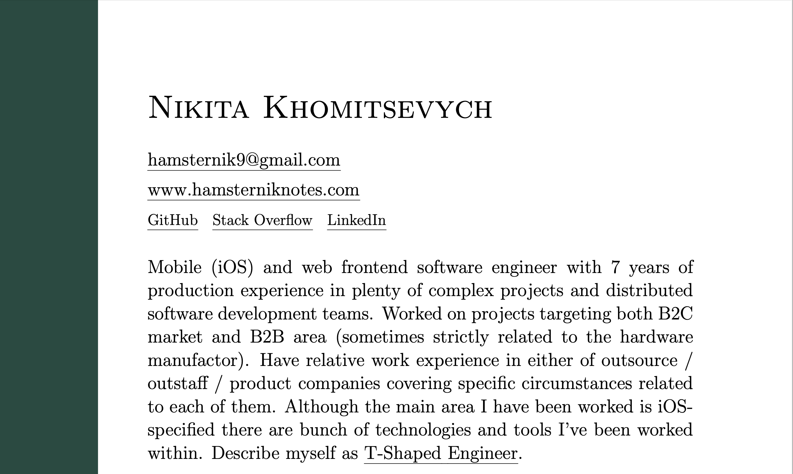

# @hamsternik resume

Resume is built with LaTeX, software system for document preparation, to have an eye candy .pdf document as output.



## Prerequisites

`latex` has to be already installed on your machine, otherwise you will not be able to build the project. I am using macOS (guess you either).

The best way to install `latex` within `tlmgr` and other required tools is [to download MacTeX](https://tug.org/mactex/mactex-download.html) distribution. I prefer [the BasicTeX](https://tug.org/mactex/morepackages.html) instead, as the off. documentation says:

> BasicTeX is a much smaller alternate TeX Distribution for users who do not want to download the full TeX Live, or have unreliable internet connections. It contains all of the standard tools needed to write TeX documents, including TeX, LaTeX, pdfTeX, MetaFont, dvips, MetaPost, and XeTeX. BasicTeX does not overwrite the full distribution; it is installed in /usr/local/texlive/2023basic

### Troubleshooting

If you have the issue `tlmgr: action not allowed in system mode: update` and use Brew, please follow the Prerequisites section an official distribution supported by the tug.org group directly.

Unfortunately, available distributions on the brew.sh are not working properly (UPD: macOS Sonoma 14.0), `tlmgr` does not allow to use any write op., eg. `install` or `update --self`. My guess a Brew distribution has issues with setting the right PATH variables. I found [the answer](https://tex.stackexchange.com/a/634438) for this issue, but in order to resolve the issue I need to fix up tlmgr config file.

Official BasicTeX (from the tug.org) does not have any of these problems. If you want to dive into installation details of the distribution, check out eg. [6. Configuring PATH and MANPATH](https://www.tug.org/mactex/BasicTeX.pdf) section.

## Build

First, install all third-party packages used in the project.

```bash
make install
```

When `make` completes to install packages, run the command to build up resume in `.pdf` format.

```bash
make all
```

### Packages

- latexmk
- xcolor
- pgf
- textpos
- fancyhdr
- ulem
- hyperref
- geometry
- setspace
- hyperref

> pgf – Create PostScript and PDF graphics in TEX. It comes with a user-friendly syntax layer called TikZ.

### Structure

Custom design for my CV defined in the nk-resume.cls _"class"_ file.

For more details about supplementary files check out [What are .cls and .sty files? How are they different?](https://tug.org/pracjourn/2005-3/asknelly/nelly-sty-&-cls.pdf)

## References

- [Using Latexmk. How to build up simple .tex document](https://mg.readthedocs.io/latexmk.html)
- [LaTeX help 1.1. Documentation](http://www.emerson.emory.edu/services/latex/latex_toc.html)
- [Yegor Bugaenko resume](https://github.com/yegor256/blog/blob/master/_latex/resume-boring.tex)
- [Firing up LaTex on macOS 🔥](https://gist.github.com/LucaCappelletti94/920186303d71c85e66e76ff989ea6b62)

## Misc

[RESUME and COVER LETTERS. Harvard Extension School](https://hwpi.harvard.edu/files/ocs/files/hes-resume-cover-letter-guide.pdf)

Tips:

- create a strong resume
- use action verbs for your resume
- write an effective cover letter
- check out sample resumes in th PDF
